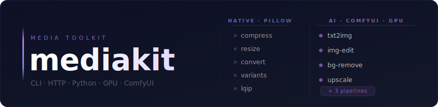

# mediakit

Local AI media toolkit for a single GPU machine. Three interfaces to one codebase: Python package, CLI, HTTP server.

| Original | Background removed | Product shot |
|---|---|---|
| 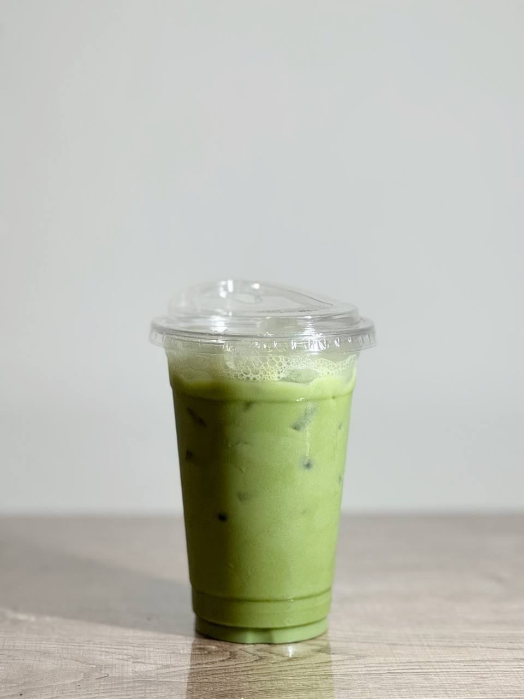 | 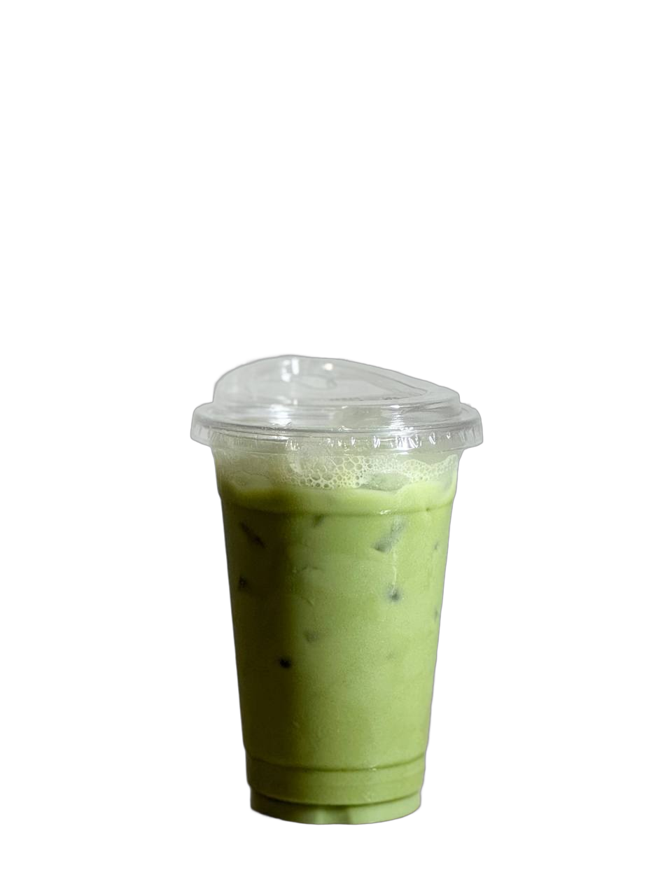 | 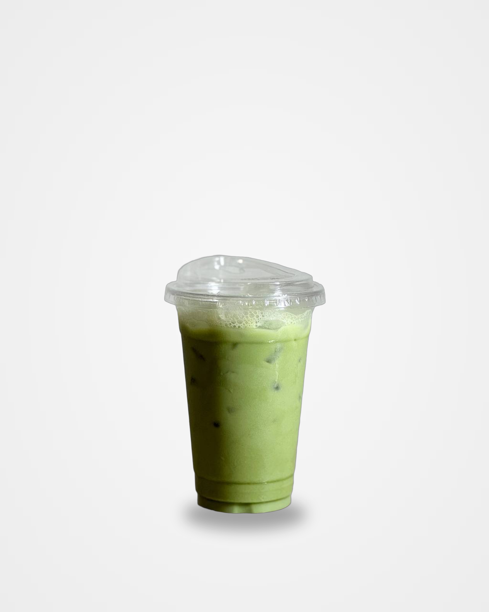 |

**Native ops** — compress, resize, convert, variants, lqip. Run in-process via Pillow. No GPU, no queue, instant result.

**AI image ops** — txt2img (SDXL or Flux 2), img-edit (SDXL or Qwen), bg-remove, upscale. Run via ComfyUI on a local GPU through an arq job queue.

**AI video ops** — txt2video (LTX-Video or Wan 2.1), img2video (LTX-Video). Animate from text or image.

---

## Gallery

All generated on a single RTX 3090 (24 GB). More in [`examples/`](examples/).

### Article covers — `article_cover` pipeline (txt2img → smart-crop 1200×630 → compress)

| | |
|---|---|
|  | 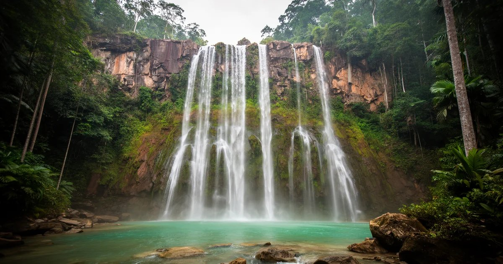 |
|  | 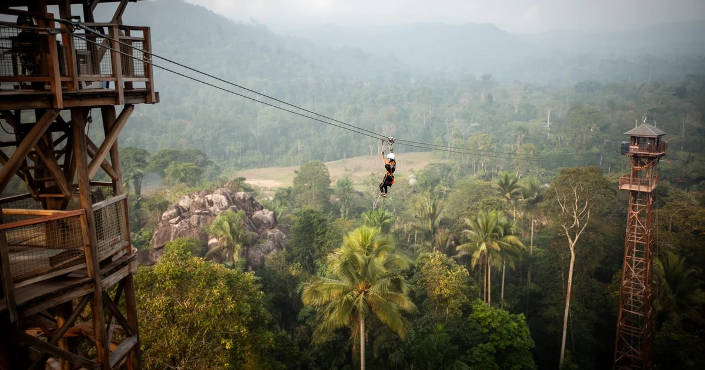 |

### Image pipelines — `product_shot` (bg-remove → contact shadow → gradient bg → upscale)

bg-remove → synthetic contact shadow → radial gradient background → 4× upscale, all in one pipeline call:

| Original | product_shot pipeline |
|---|---|
|  | 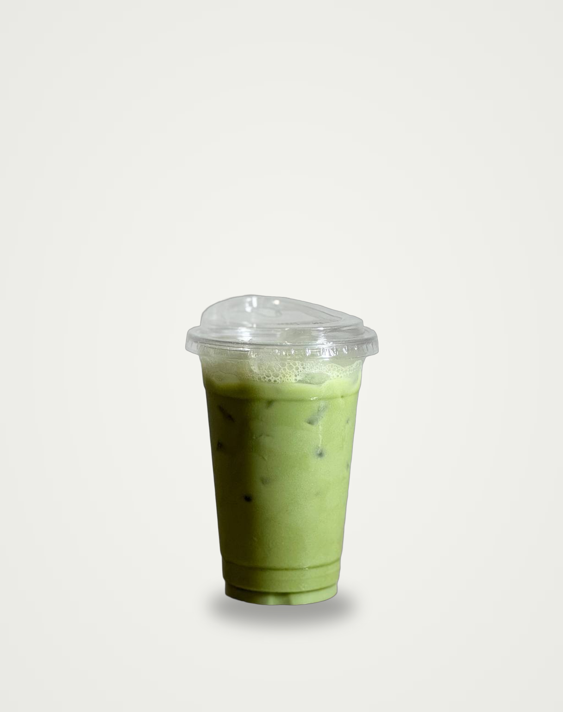 |

> Before/after side-by-side: [examples/product_shot/before-after.jpg](examples/product_shot/before-after.jpg)

### Image pipelines — `photo_finalize` (bg-remove → upscale → compress)

Original (43 KB, 960×1280) → transparent cutout → 2× upscale compressed to 68 KB WebP (1920×2560):

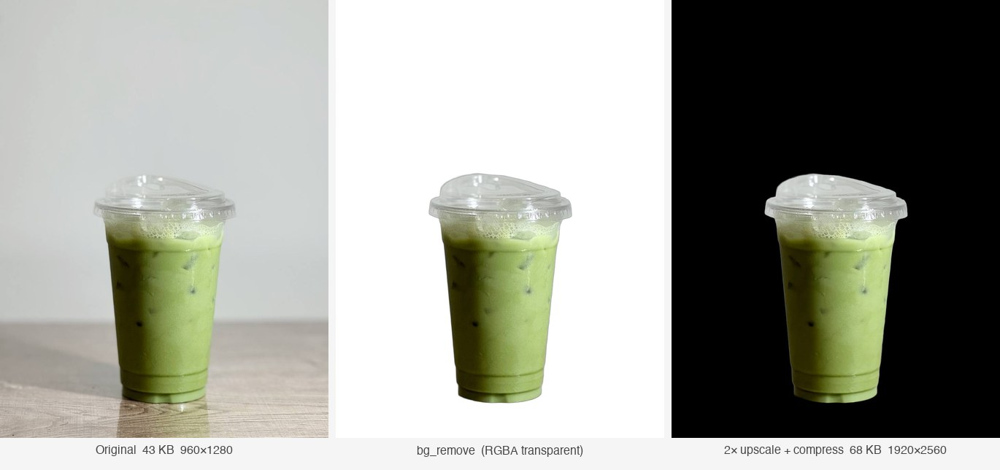

### Image pipelines — `upscale` (NMKD-Siax 4×)

Tight crop — same zone at input resolution vs 4× ESRGAN upscale (960×1280 → 3840×5120):

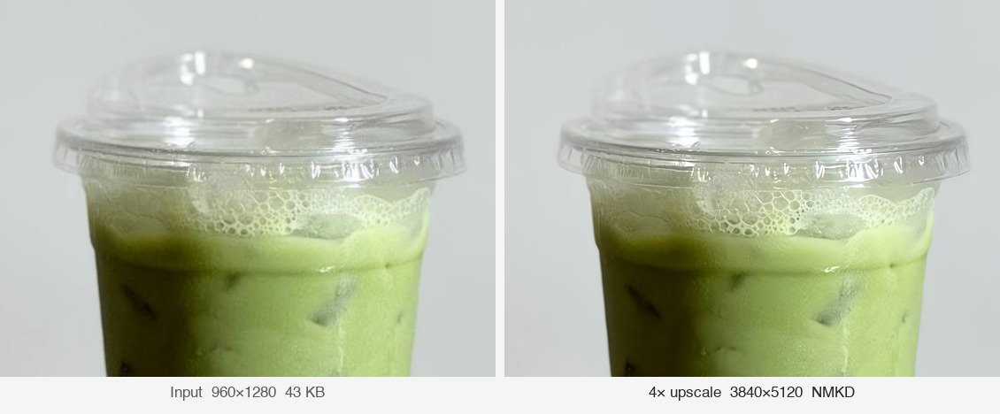

### Image pipelines — `responsive_set` (compress → variants → lqip)

Native, **no GPU**: one source image → a responsive WebP/AVIF width ladder plus a
tiny inline LQIP blur placeholder. Runs in-process via Pillow in under a second.

The 123-byte LQIP placeholder (left — an upscaled 16×8 WebP) renders instantly as a
Next.js `blurDataURL` while the full image (right) loads:


Responsive WebP ladder from a 167 KB / 1200 px source — smaller screens fetch less:

| Variant | WebP |
|---|---|
| 640w | 48 KB |
| 768w | 68 KB |
| 1024w | 109 KB |

> AVIF variants are emitted alongside WebP for format negotiation. Regenerate with
> `mediakit variants photo.jpg --formats webp,avif` or the `responsive_set` pipeline.

### Video — `img2video` (CogVideoX-5B-I2V)

Animate a still photo into a short clip — 49 frames @ 8 fps on RTX 3090:

| Input photo | img2video (CogVideoX-5B-I2V) |
|---|---|
|  | 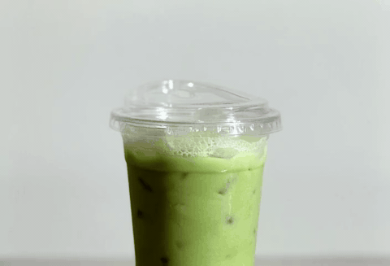 |

> GIF is a downscaled preview (251 KB). Source clip is 720×480 MP4, 2 s — regenerate with
> `mediakit img2video --input photo.jpg --prompt "subtle zoom in, product still" --model cogvideox`.

### Video — `txt2video` / `img2video` (LTX-Video, placeholder clips)

| | |
|---|---|
| 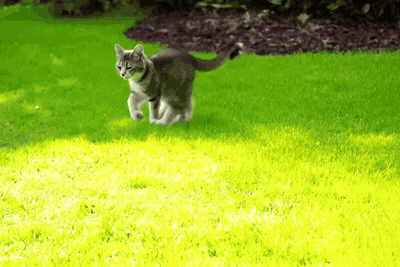 | 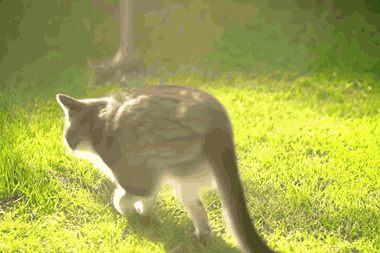 |

> Placeholder LTX-Video clips. Regenerate with `mediakit txt2video --prompt "..." --model ltxv --length 49`.

---

## Requirements

- Python 3.11
- [uv](https://docs.astral.sh/uv/)
- Redis 7
- ComfyUI running at `http://127.0.0.1:8188` *(AI ops only)*

**ComfyUI models** *(AI ops only)*:
- `checkpoints/RealVisXL_V5.0_inpainting.safetensors` — txt2img, img-edit
- `upscale_models/4x_NMKD-Siax_200k.pth` — upscale
- BiRefNet — downloaded automatically on first use

---

## Install

```bash
git clone <repo>
cd mediakit
uv sync --extra dev
cp .env.example .env
# edit .env as needed
```

---

## Start

```bash
# Redis
docker-compose up -d redis

# arq worker (required for AI ops and pipelines)
uv run mediakit-worker

# HTTP server (optional)
uv run mediakit-server
# → http://localhost:8000/docs
```

---

## CLI

```bash
# Native — no GPU needed
mediakit compress photo.jpg --format webp --quality high
mediakit compress photo.jpg --format jpeg --quality 82 --max-width 1920

mediakit resize photo.jpg --width 1200 --height 630 --mode smart_crop
mediakit resize photo.jpg --width 800  --height 600 --mode pad
# modes: fit | fill | smart_crop | pad

mediakit convert photo.png --format webp

mediakit variants photo.jpg --sizes 640,768,1024,1280,1536 --formats webp,avif

mediakit lqip photo.jpg
# → data:image/webp;base64,... (for Next.js blurDataURL)

# AI image — requires ComfyUI
mediakit bg-remove --input product.jpg
mediakit bg-remove --input product.jpg --model BiRefNet-portrait --bg color --color "#FFFFFF"

mediakit upscale --input photo.jpg --scale 2.0
mediakit upscale --input photo.jpg --scale 4.0 --model RealESRGAN_x4.pth

# txt2img: SDXL (default) or Flux 2
mediakit txt2img --prompt "clean white studio, product photography" --width 1024 --height 1024
mediakit txt2img --prompt "abstract tech cover" --backend flux --cfg 3.5 --steps 20

# img-edit: SDXL inpainting (default) or Qwen Image Edit
mediakit img-edit --input product.jpg --prompt "white studio background"
mediakit img-edit --input product.jpg --prompt "white studio background" --backend qwen --lora-strength 1.0

# AI video — requires ComfyUI + video models (LTX-Video, Wan 2.1)
mediakit txt2video --prompt "Bangkok night market, golden hour" --model ltxv --length 49
mediakit txt2video --prompt "cinematic drone shot" --model wan --length 33 --fps 16
mediakit img2video --input photo.jpg --prompt "person slowly looks to camera" --length 49

# Server shortcuts
mediakit serve    # same as mediakit-server
mediakit worker   # same as mediakit-worker
```

---

## HTTP API

```bash
BASE=http://localhost:8000
TOKEN=changeme

# Health check
curl $BASE/healthz

# Native op — 200 immediately
curl -X POST $BASE/v1/ops/compress \
  -H "Authorization: Bearer $TOKEN" \
  -F "file=@photo.jpg" -F "format=webp" -F "quality=high"

curl -X POST $BASE/v1/ops/lqip \
  -H "Authorization: Bearer $TOKEN" \
  -F "file=@photo.jpg"
# → {"data_url":"data:image/webp;base64,...","width":16,"height":9}

# AI op — 202 + job_id
curl -X POST $BASE/v1/ops/txt2img \
  -H "Authorization: Bearer $TOKEN" \
  -F "prompt=white studio product photography" \
  -F "width=1024" -F "height=1024"
# → {"job_id":"abc123","status":"queued"}

# Poll status
curl $BASE/v1/jobs/abc123 -H "Authorization: Bearer $TOKEN"
# → {"status":"complete","result":{"output":"...","seed":42},...}

# Download result file
curl -O $BASE/v1/jobs/abc123/output -H "Authorization: Bearer $TOKEN"
# → 409 if not complete yet, 410 if cleaned up

# Pipeline: article cover (txt2img → crop → compress)
curl -X POST $BASE/v1/pipelines/article-cover \
  -H "Authorization: Bearer $TOKEN" \
  -F "prompt=Bangkok street market, golden hour photography" \
  -F "slug=bangkok-guide" \
  -F "output_dir=/path/to/public/images/blog/bangkok-guide"

# Pipeline: responsive set (compress → variants → lqip)
curl -X POST $BASE/v1/pipelines/responsive-set \
  -H "Authorization: Bearer $TOKEN" \
  -F "file=@photo.jpg" \
  -F "sizes=640,768,1024,1280,1536" \
  -F "formats=webp,avif"
```

Authorization is disabled when `API_TOKEN` is empty.

Full route list: see `/docs` (Swagger UI), the committed [openapi.json](openapi.json), or [DOCS.md](docs/DOCS.md).

---

## Python

```python
import asyncio
from pathlib import Path
from mediakit import ops, pipelines
from mediakit.schemas.ops import CompressParams, ImageFormat, LqipParams, Quality, ResizeMode, ResizeParams
from mediakit.schemas.ai_ops import BgRemoveParams, Txt2ImgParams

async def main():
    # Native ops — fast, no GPU
    result = await ops.compress(CompressParams(
        input=Path("photo.jpg"),
        format=ImageFormat.webp,
        quality=Quality.high,
    ))
    print(f"saved {result.savings_pct:.0f}%")

    placeholder = await ops.lqip(LqipParams(input=Path("photo.jpg")))
    print(placeholder.data_url)  # data:image/webp;base64,...

    # AI ops — require ComfyUI running
    result = await ops.bg_remove(BgRemoveParams(input=Path("product.jpg")))

    result = await ops.txt2img(Txt2ImgParams(
        prompt="minimalist white studio background",
        width=1024,
        height=1024,
        seed=42,  # -1 = random
    ))

    # Pipelines
    result = await pipelines.article_cover.run(
        prompt="Bangkok night market, golden hour",
        slug="bangkok-guide",
        output_dir=Path("public/images/blog/bangkok-guide"),
    )
    print(result.outputs)   # [cover.jpg, cover-640w.webp, ...]
    print(result.meta)      # {"seed": 12345, "slug": "bangkok-guide"}

asyncio.run(main())
```

---

## Quality presets

| Preset | JPEG/WebP quality |
|--------|-------------------|
| `low`  | 60                |
| `medium` | 75              |
| `high` | 85                |
| `max`  | 95                |

Pass an integer (0–100) to override.

---

## Pipelines

| Pipeline | Steps | Output |
|----------|-------|--------|
| `article_cover` | txt2img (sdxl\|flux) → smart_crop(1200×630) → compress | Blog OG cover + optional variants |
| `responsive_set` | compress → variants(webp+avif) → lqip | Next.js-ready responsive set |
| `photo_finalize` | bg_remove → upscale → compress | Product photo ready for marketplace |

---

## Configuration

Copy `.env.example` to `.env` and adjust:

```bash
# Key settings
COMFYUI_URL=http://127.0.0.1:8188
REDIS_URL=redis://localhost:6379/0
API_TOKEN=changeme            # empty = auth disabled
STORAGE_MAX_UPLOAD_MB=20
LOG_FORMAT=console            # console | json
SENTRY_DSN=                  # empty = disabled

# Optional: check that required models are present at worker startup
# COMFYUI_MODELS_DIR=/path/to/ComfyUI/models
```

---

## Tests

```bash
# Unit tests — native ops only, no GPU or Redis
uv run pytest tests/unit/ -v

# Integration tests — full HTTP layer, Redis and ComfyUI mocked
uv run pytest tests/integration/ -v

# All
uv run pytest tests/ -v
```

---

## Architecture

```
Consumer (bubnov.io / tg-bot / scripts)
         │
    ┌────┴─────────────┐
    ▼                  ▼
FastAPI :8000       Typer CLI
/v1/ops/*           mediakit compress ...
/v1/jobs/*          mediakit txt2img ...
/v1/pipelines/*
    │
    └──→ arq queue (Redis)
              │
              ▼
         arq Worker (max_jobs=1)   ← GPU concurrency hard-limit
              │
              ▼
         ComfyUI :8188
```

Native ops run synchronously inside the FastAPI process. Nothing that touches the GPU runs outside the worker.

---

## License

MIT — see [LICENSE](LICENSE).
