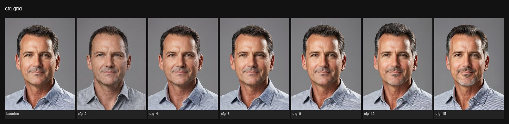
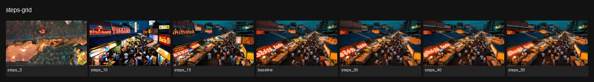
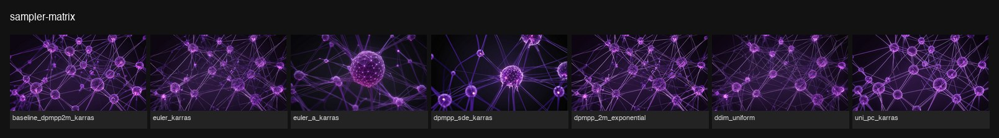
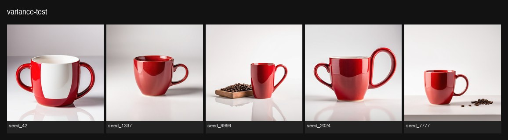
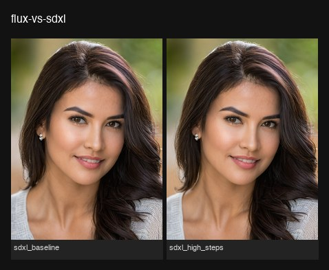

# Lab experiments

Systematic parameter sweeps run on a single RTX 3090 (24 GB) via `lab/runner.py`.
Each grid uses a fixed seed to isolate the effect of one variable at a time.
Results inform the default parameters in pipeline configs.

---

## CFG scale — how much does guidance strength matter?

**Grid:** 7 values (2 → 15), seed 42, 768×1024 portrait, RealVisXL, 25 steps.

**Finding:** RealVisXL is robust across the full CFG range. No oversaturation at 12–15, no muddy loss of detail at 2–4. The SDXL architecture's conditioning is strong enough that the model follows the prompt at any guidance level tested. Subtle framing differences appear but quality stays high throughout.

**Conclusion:** Default **CFG 7.5** confirmed. No benefit to tuning CFG for this model/use-case; spend tuning budget elsewhere.

---

## Steps — where does quality plateau?

**Grid:** 7 values (5 → 50), seed 42, 1280×720 street scene, RealVisXL, CFG 7.5.

| Steps | Result | Time |
|---|---|---|
| 5 | Unusable — dark blobs, unrecognizable subject | 5 s |
| 10 | Rough draft — correct scene, low detail | 6 s |
| 15 | Usable — readable text, decent structure | 8 s |
| **25** | **Production quality — sharp, detailed, correct lighting** | **12 s** |
| 30 | Nearly identical to 25 | 14 s |
| 40 | Marginal gain in micro-texture | 18 s |
| 50 | Imperceptibly sharper than 40 | 22 s |

**Conclusion:** **25 steps is the sweet spot.** Quality jumps sharply from 5→15, then plateaus. Steps 30–50 add ~2–10 s of GPU time for no visible gain in these conditions. Default confirmed.

---

## Sampler comparison

**Grid:** 7 sampler+scheduler pairs, seed 42, 1280×720 abstract tech, RealVisXL, 25 steps.

| Sampler | Time | Character |
|---|---|---|
| **dpmpp_2m + karras** | 13 s | Stable, detailed, consistent — best all-round |
| euler + karras | 12 s | Very similar to dpmpp_2m, slightly softer |
| euler_a + karras | 12 s | Different stochastic path → different composition; useful for exploring |
| **dpmpp_sde + karras** | **23 s** | 2× slower, dramatically different framing; use only when diversity > speed |
| dpmpp_2m + exponential | 12 s | Virtually identical to karras variant |
| ddim + uniform | 12 s | Consistent, slightly flatter contrast |
| uni_pc + karras | 12 s | Fast convergence, clean result |

**Conclusion:** **`dpmpp_2m + karras` is the best default** — fastest stable path, most detail retention. `euler_a` is useful for seed exploration runs (max composition diversity). `dpmpp_sde` only justified when you specifically need a different angle and have the time budget.

---

## Output variance across seeds

**Grid:** 5 seeds (42, 1337, 9999, 2024, 7777), same params, 1024×1024 product shot, RealVisXL.

**Finding:** Same prompt at CFG 7.5 / 25 steps produces markedly different compositions across seeds — different angles, different props (coffee beans appear in some), different background tones. This is typical of generative models and expected at CFG 7.5.

**Conclusion:** For **production use**, run 3–5 seeds and cherry-pick the best composition. For **systematic comparison** experiments, fix seed=42. The model is not "unreliable" — it's exploring the prompt's composition space normally.

---

## SDXL steps comparison (flux-vs-sdxl grid, SDXL-only)

**Grid:** 2 variations (25 steps vs 40 steps), seed 42, 768×1024 portrait, RealVisXL.

**Finding:** 25 vs 40 steps on a 768×1024 portrait — visually indistinguishable at normal viewing size. The 40-step image is marginally sharper at pixel level but does not justify the 50% time increase (+5 s per image) for most use cases.

**Conclusion:** **25 steps confirmed for SDXL portraits.** Reserve 40 steps for final hero shots where the extra quality is meaningful.

---

## Winning defaults (confirmed by experiments)

These defaults are already set in the pipeline configs and validated by the grids above:

| Parameter | Value | Rationale |
|---|---|---|
| `cfg` | 7.5 | Mid-range; SDXL is stable across 2–15, 7.5 gives good prompt adherence |
| `steps` | 25 | Quality plateau — 30+ adds time with no visible gain |
| `sampler` | `dpmpp_2m` | Most detail, most consistent, same speed as alternatives |
| `scheduler` | `karras` | Standard companion for dpmpp_2m; exponential is equivalent |
| `checkpoint` | RealVisXL v5 | Best all-round SDXL checkpoint for photorealistic output |

---

## What's next

- **Flux 2 comparison** — Flux variations are commented out in `flux-vs-sdxl.yaml`. Uncomment and run once `flux2_dev_fp8mixed.safetensors` is verified on the box. Expected: better anatomy and complex-prompt understanding vs. SDXL.
- **Qwen img-edit sweep** — `lora-strength.yaml` and `qwen-vs-sdxl.yaml` variations are ready; uncomment after Qwen workflow is verified.
- **SD 1.5 baseline** — `model-compare.yaml` includes `sd15-base`; run once `v1-5-pruned-emaonly-fp16.safetensors` is confirmed present.
